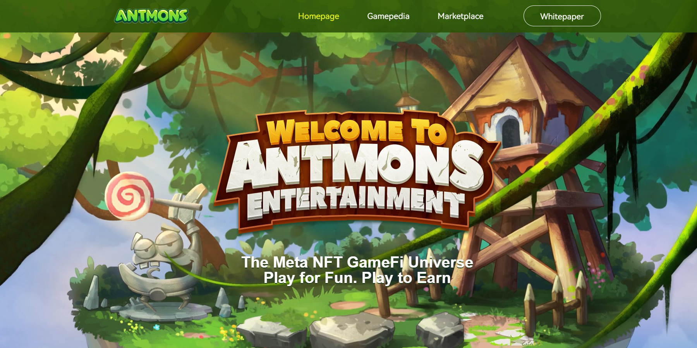
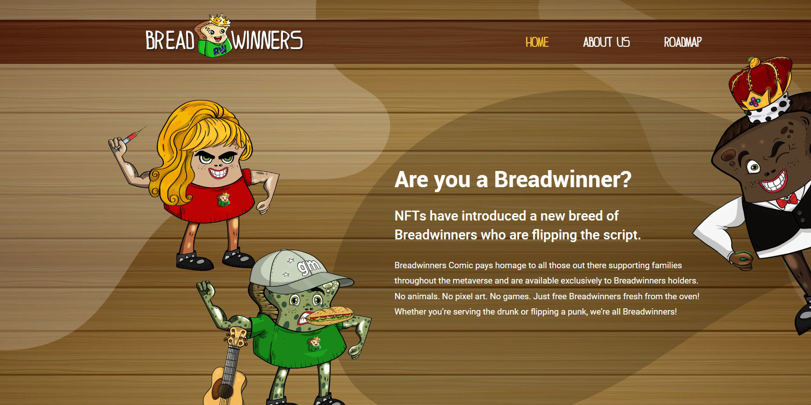
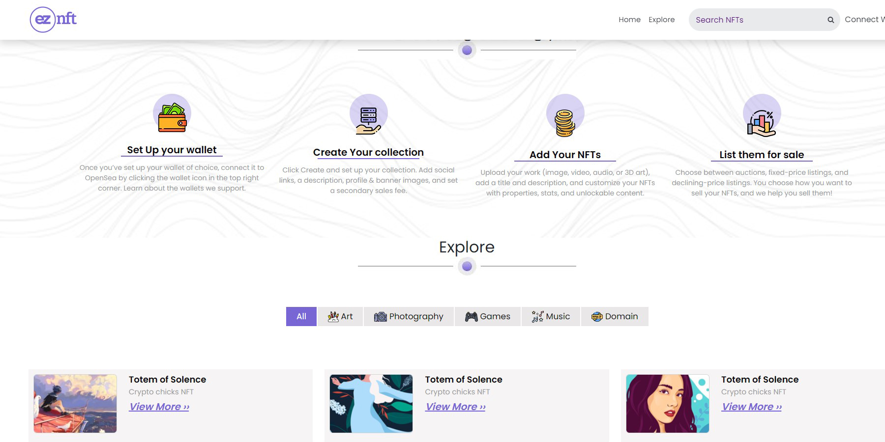
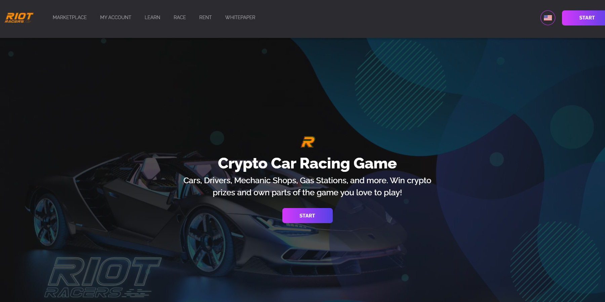
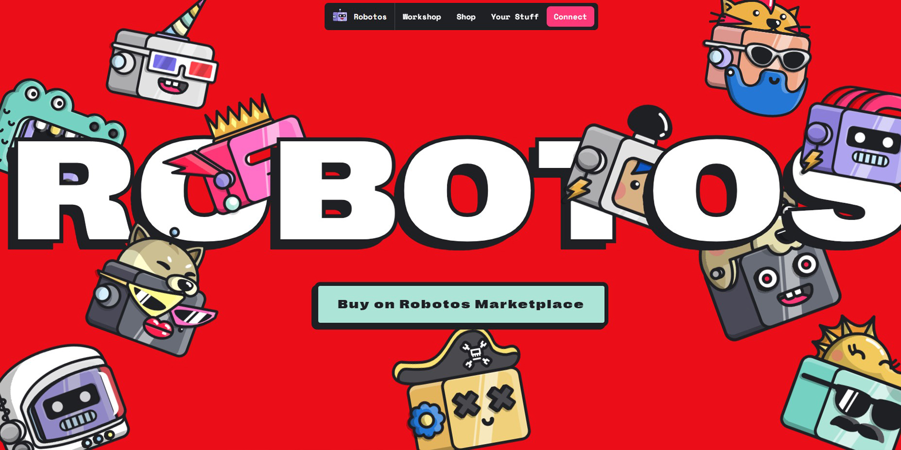
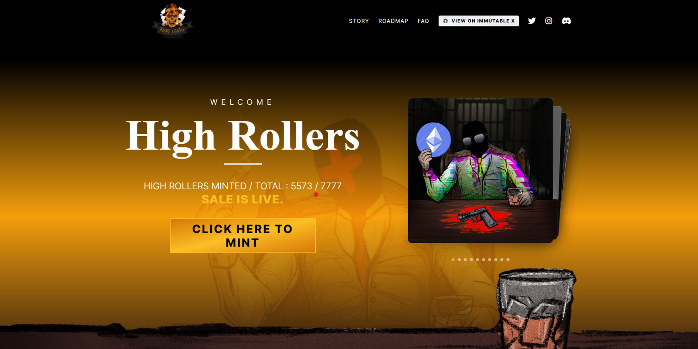
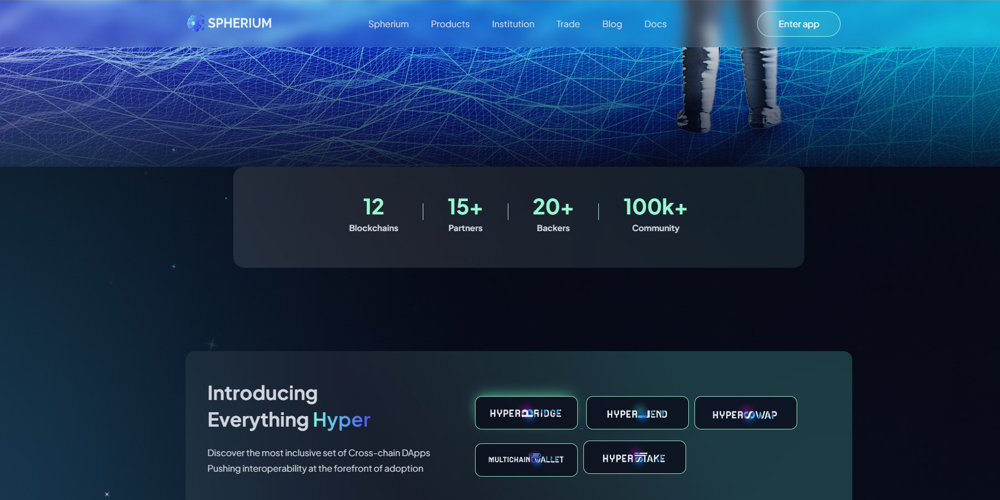

<h2 align="center">
  <strong>
    🥷 Full stack software engineer (🔗blockchain / 🌐web / 📱mobile)
  </strong>
</h2>

  

<h2>
  <strong>🖊️ Description</strong>
</h2>

  ✨ Full-stack developer specialized in not only web2 and hybrid mobile application development but also web3 development.
  
  <ul>
    <li>Passionate crypto learner and creator of web3 projects such as De-fi, Game-fi, NFT</li>
    <li>Experienced full-stack developer of web2 and mobile application development.</li>
    <li>Team contributor familiar with the agile and remote work culture.</li>
  </ul>
  
  <strong>🤔 Goals</strong>
  
  <ul>
    <li>Contributor of <a href="https://github.com/meta-dev-org">Meta Dev Org</a> and <a href="https://github.com/pro-crypto-bots">Crypto Bots</a></li>
    <li>I love reading book and learning new technologies and innovative ideas</li>
    <li>Enthusiastic contributor for open source code and non-profit projects</li>
  </ul>
  
  <strong>🔭Expertise</strong>
  <ul>
    <li>Writing solidity smart contracts for EVM compatible chains and Rust program for Solana.</li>
    <li>Developing web front-end, back-end, and RESTful API</li>
    <li>Developing hybrid mobile application with a clean and attractive designs.</li>
  </ul>

<strong>⚡Specialization</strong>

  <ul>
    <li>ERC-20, ERC-721, ERC-1155, EIP2535, SPL </li>
    <li>NFT marketplace, TokenSwap, wallets, bots for DEX and CEX</li>
    <li>Hybrid mobile application built with React Native and Flutter</li>
  </ul>
  
  <table width="100%" style="border: 1px solid">
    <thead align="center">
      <tr style="border: 1px solid">
        <td style="border: 1px solid">💻</td>
        <td style="border: 1px solid">🌐</td>
        <td style="border: 1px solid">🔗</td>
        <td style="border: 1px solid">📱</td>
        <td style="border: 1px solid">🗄️</td>
      </tr>
    </thead>
    <tbody>
      <tr>
        <td valign="top" style="border: 1px solid">
          <ul>
            <li>JavaScript</li>
            <li>TypeScript</li>
            <li>Go</li>
            <li>Python</li>
            <li>node.js</li>
            <li>web3.js</li>
            <li>ethers.js</li>
            <li>web3.py</li>
          </ul>
        </td>
         <td valign="top" style="border: 1px solid">
          <ul>
            <li>React</li>
            <li>Next</li>
            <li>Vue.js</li>
            <li>Electron</li>
            <li>Express.js</li>
            <li>nest.js</li>
            <li>Django</li>
          </ul>
        </td>
         <td valign="top" style="border: 1px solid">
          <ul>
            <li>Solidity</li>
            <li>Rust</li>
            <li>Truffle</li>
            <li>Hardhat</li>
            <li>Ganache</li>
            <li>Anchor</li>
            <li>Chainlink</li>
            <li>Graph</li>
          </ul>
        </td>
         <td valign="top" style="border: 1px solid">
          <ul>
            <li>ReactNative</li>
            <li>Flutter</li>
            <li>Swift</li>
            <li>Android</li>
          </ul>
        </td>
        <td PfanP
        valign="top" style="border: 1px solid">
          <ul>
            <li>MySQL</li>
            <li>PostgreSQL</li>
            <li>MongoDB</li>
            <li>DynamoDB</li>
          </ul>
        </td>
      </tr>
    </tbody>
  </table>

<h2><strong>🌱 Experiences</strong></h2>

<table align="center" style="border: 1px solid">
  <thead align="center">
    <tr align="center">
      <th align="center" style="border: 1px solid">Antmons</th>
      <th align="center" style="border: 1px solid">BreadwinnersNFT</th>
      <th align="center" style="border: 1px solid">EZ.NFT</th>
      <th align="center" style="border: 1px solid">Riot Racers</th>
    </tr>
  </thead>
  <tbody align="center">
    <tr>
      <td style="border: 1px solid">
        
      </td>
      <td style="border: 1px solid">
        
      </td>
      <td style="border: 1px solid">
        
      </td>
      <td style="border: 1px solid">
        
      </td>
    </tr>
  </tbody>
</table>

<table align="center" style="border: 1px solid">
  <thead align="center">
    <tr align="center">
      <th align="center" style="border: 1px solid">Robotos Art</th>
      <th align="center" style="border: 1px solid">HighRollerNFT</th>
      <th align="center" style="border: 1px solid">Spherium.finance</th>
      <th align="center" style="border: 1px solid">Tired Troop</th>
    </tr>
  </thead>
  <tbody align="center">
    <tr>
      <td style="border: 1px solid">
        
      </td>
      <td style="border: 1px solid">
        
      </td>
      <td style="border: 1px solid">
        
      </td>
      <td style="border: 1px solid">
        
      </td>
    </tr>
  </tbody>
</table>

